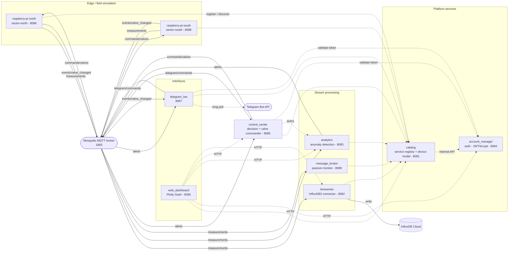
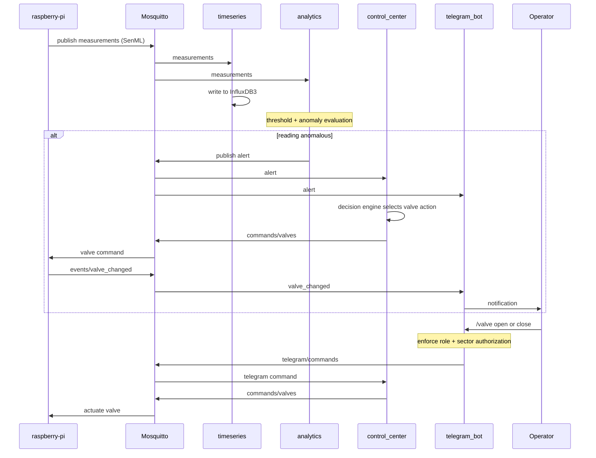
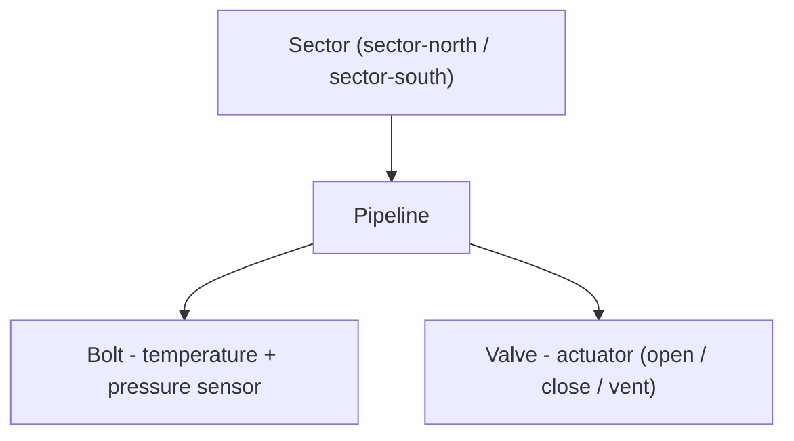

# Smart IoT Bolt

Distributed monitoring and valve-control platform for industrial pipelines. "Smart bolts" mounted on pipeline segments report **temperature** and **pressure**; the system persists the telemetry, detects anomalies in real time, and autonomously (or manually) actuates **valves** to keep each pipeline within safe limits. Operators interact through a Telegram bot and a web dashboard.

The system is a set of Python microservices that communicate over two planes:

- **MQTT data plane** (Eclipse Mosquitto) — high-frequency telemetry, alerts, valve commands, and events.
- **REST control plane** (CherryPy) — service discovery, configuration, authentication, historical queries, and manual control.

A central **catalog** acts as the service registry and device model; every other service registers with it and discovers peers through it.

---

## Architecture



Legend: **solid arrows** = MQTT messages (labelled with the topic family); **dotted arrows** = REST/HTTP calls.

### Closed control loop



### Device model

The catalog stores the physical topology as a nested hierarchy:



---

## Services

| Service | Port | Responsibility |
|---|---|---|
| `catalog` | 8081 | Service registry (active `/health` probing) and authoritative device/config model; proxies user lookups to `account_manager`. No MQTT. |
| `timeseries` (`timeSeriesDbConnector`) | 8082 | Subscribes to telemetry, writes to InfluxDB3, serves historical queries over REST. |
| `analytics` | 8083 | Threshold checks, trend/anomaly detection; publishes alerts. |
| `account_manager` | 8084 | User accounts, login, JWT issuance/validation (bcrypt password hashes) in SQLite; internal user API for other services. No MQTT. |
| `control_center` | 8085 | Decision engine + valve commander; reacts to alerts and manual commands, publishes valve commands. |
| `raspberry-pi-north` | 8086 | Edge node simulator for `sector-north`: generates sensor data, publishes telemetry, applies valve commands. |
| `telegram_bot` | 8087 | Telegram interface: alerts, status queries, and authorized valve/emergency commands. |
| `raspberry-pi-south` | 8088 | Edge node simulator for `sector-south` (same shape as north). |
| `message_broker` | 8089 | Passive MQTT traffic monitor and Mosquitto lifecycle helper; read-only stats over REST. |
| `web_dashboard` | 8090 | Plotly Dash UI aggregating the other services over HTTP. The only service published to the host in the base compose. |
| `mosquitto` | 1883 | Eclipse Mosquitto MQTT broker (message bus). |

---

## Communication

### MQTT topics (data plane)

| Topic pattern | Payload | Published by | Subscribed by |
|---|---|---|---|
| `sectors/{sector}/pipelines/{pipeline}/measurements` | SenML telemetry (temperature, pressure) | `raspberry-pi-north`, `raspberry-pi-south` | `timeseries`, `analytics`, `message_broker` |
| `sectors/{sector}/pipelines/{pipeline}/alerts/{alert_type}` | Alert record | `analytics` | `control_center`, `telegram_bot` |
| `sectors/{sector}/pipelines/{pipeline}/commands/valves` | Valve command | `control_center` | `raspberry-pi-north`, `raspberry-pi-south` |
| `events/valve_changed` | Valve state-change event | `raspberry-pi-north`, `raspberry-pi-south` | `telegram_bot` |
| `telegram/commands/{pipeline_id}` | Operator command | `telegram_bot` | `control_center` |

Each edge node subscribes only to its own sector's `commands/valves`; consumers of telemetry and alerts use single-level wildcards (`sectors/+/pipelines/+/...`).

### REST surface (control plane)

Every service exposes `GET /health` (used by Docker healthchecks). Principal endpoints:

- **catalog** — `GET /services`, `POST /services/register`, `GET|POST|PUT|DELETE /pipelines[/{id}]`, `PUT /bolts/{id}`, `PUT /valves/{id}`, `GET /config?section=...`, `GET /users[/{id}]`, plus internal-key-gated `PUT /sectors/{id}/owner` and `DELETE /sectors/by-owner/{id}`.
- **account_manager** — `POST /login`, `GET /validate`, user CRUD, and `X-Internal-API-Key`-gated `GET|PUT /internal/users[...]`, `/internal/chat-ids`.
- **analytics** — `GET /summary`, `/statistics`, `/trend`, `/risk`, `/prediction`, `/anomalies`, `/alerts`, `/aggregated`, `/measurements`, consumed by `control_center`, `telegram_bot`, and `web_dashboard`.
- **control_center** — `POST /manual` (Bearer token + `control` permission) and `POST /emergency` for actuation.
- **timeseries** — `GET /stats` and `GET /summary` over the InfluxDB3 buckets (plus `/health`).

Inter-service privileged calls are authenticated with a shared `X-Internal-API-Key`; user-facing actuation paths require an `account_manager` JWT.

---

## Tech stack

- **Language / runtime:** Python (Docker image: `python:3.12-slim`; local: Python 3.11+).
- **Web / REST:** CherryPy; Plotly Dash + `dash-bootstrap-components` (dashboard).
- **Messaging:** Eclipse Mosquitto 2 with `paho-mqtt` (shared wrapper in `MyMQTT.py`).
- **Storage:** InfluxDB3 (`influxdb3-python`) for time series; SQLite for accounts; JSON file for the catalog model.
- **Auth:** `PyJWT` + `bcrypt`.
- **Other:** `requests`, `python-dotenv`, `python-telegram-bot`, `pandas`.

---

## Repository layout

```
.
├── catalog/                 # service registry + device/config model (8081)
├── account_manager/         # auth, accounts, JWT (8084)
├── analytics/               # anomaly detection (8083)
├── control_center/          # decision engine + valve commander (8085)
├── timeSeriesDbConnector/   # InfluxDB3 connector (8082)
├── message_broker/          # passive MQTT monitor (8089)
├── raspberry-pi-north/      # edge simulator, sector-north (8086)
├── raspberry-pi-south/      # edge simulator, sector-south (8088)
├── telegram_bot/            # Telegram interface (8087)
├── web_dashboard/           # Plotly Dash UI (8090)
├── mosquitto/               # broker configuration
├── MyMQTT.py                # shared paho-mqtt wrapper
├── internal_auth.py         # shared internal-API-key resolver
├── Dockerfile               # single image, run with a per-service working_dir
├── docker-compose.yml       # full topology
└── docker-compose.override.yml  # optional: expose internal ports to the host
```

All services are built from one image and started with a different `working_dir` and `command` (see `docker-compose.yml`).

---

## Configuration

Each service is configured through a local `.env` file (loaded with `python-dotenv`, and via `env_file:` in compose). These files are **git-ignored and must never be committed** — they hold credentials. Create them per service before running.

Non-secret variables (ports, service URLs, thresholds, simulation parameters) are documented inline in each service's `.env`. The **sensitive** variables that must be supplied are:

| Service | Required secrets / credentials |
|---|---|
| `account_manager` | `JWT_SECRET_KEY`, `INTERNAL_API_KEY`, `DEFAULT_ADMIN_USERNAME` / `DEFAULT_ADMIN_PASSWORD` / `DEFAULT_ADMIN_EMAIL` |
| `catalog`, `analytics` | `INTERNAL_API_KEY` (must match `account_manager`) |
| `telegram_bot` | `TELEGRAM_BOT_TOKEN` |
| `timeSeriesDbConnector` | `INFLUXDB_URL`, `INFLUXDB_TOKEN`, `INFLUXDB_ORG`, `INFLUXDB_BUCKET_NORTH`, `INFLUXDB_BUCKET_SOUTH` |
| shared (repo root) | `.internal_api_key` file, or the `INTERNAL_API_KEY` environment variable, resolved by `internal_auth.py` |

The same `INTERNAL_API_KEY` must be identical across `catalog`, `account_manager`, and `analytics`, since it secures inter-service calls.

### Security notes

- The default `mosquitto/mosquitto.conf` enables **anonymous access with no TLS** (`allow_anonymous true`) for local development. For any non-local deployment, configure broker authentication, per-topic ACLs, and TLS, since the bus carries valve-actuation commands.
- `docker-compose.override.yml` publishes the internal service ports (and `1883`) to the host so native/desktop clients can reach them at `localhost`. Remove this file to keep only `web_dashboard` (8090) exposed.
- Never commit `.env`, `.internal_api_key`, `*.db`, or `catalog/catalog.json` (it can contain user chat IDs).

---

## Running

### Docker Compose (recommended)

Builds one image and starts all services in dependency order with healthchecks.

```bash
# 1. Create the per-service .env files (see Configuration).
# 2. Build and start the whole system:
docker compose up --build
```

The web dashboard is then available at <http://localhost:8090>. To also expose the individual service ports and the MQTT broker on the host, keep `docker-compose.override.yml` in place (it is merged automatically).

### Local (without Docker)

```bash
python -m venv .venv && source .venv/bin/activate
pip install -r requirements.txt
# Start a Mosquitto broker on 1883, then start each service:
#   cd <service_dir> && python main.py
# (web_dashboard uses app.py)
```

Start order: `catalog` first, then `mosquitto`, then the remaining services (`timeseries`, `account_manager`, `analytics`, `control_center`, the edge simulators, `telegram_bot`, `web_dashboard`). Services wait for the catalog to be healthy before registering.

### Windows helper scripts

`setup.bat` provisions the environment; `run_all.bat` launches every service in its own window in the correct order; `stop_all.bat` stops them.

---

## Port reference

| Port | Service |
|---|---|
| 1883 | Mosquitto MQTT broker |
| 8081 | catalog |
| 8082 | timeseries |
| 8083 | analytics |
| 8084 | account_manager |
| 8085 | control_center |
| 8086 | raspberry-pi-north |
| 8087 | telegram_bot |
| 8088 | raspberry-pi-south |
| 8089 | message_broker |
| 8090 | web_dashboard |
